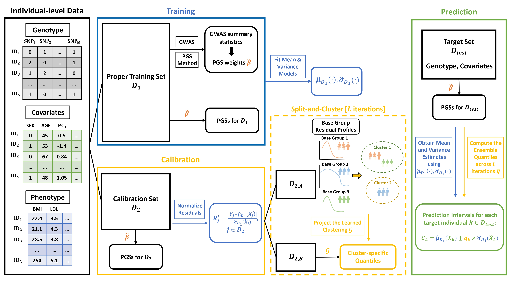

# C-SCNR
Clustering-based Split Conformal Prediction with Normalized Residuals (C-SCNR)

## Description
This repository contains the codes for the methods, simulation studies, and real-data applications.

## Repository Structure
```text
├── README.md
|                   
├── simulations/                ## Scripts for simulation studies
|   ├── simulation_study_I-IV   # R scripts to simulate the synthetic data
|   ├── benckmark_methods       # R scripts to implement benchmark methods
|   ├── proposed_methods        # R scripts for proposed methods
|   └── PGS_scripts             # scripts to obtain the PGSs
|
├── real_data_applications/     ## Scripts for real-data applications
    ├── benckmark_methods
    ├── proposed_methods
    └── PGS_scripts
```

## Overview of C-SCNR
<p align="center">
  
</p>

## Tutorial
The following instruction walks you through the pipeline to construct conformal prediction intervals with **C-SCNR**, in assistance of the codes in this repository.

### Softwares
```text
PLINK (v1.9) https://www.cog-genomics.org/plink/
PLINK (v2.0) https://www.cog-genomics.org/plink/2.0/
R            https://www.r-project.org/
```

### R packages
```text
lassosum
parallel
data.table
tidyverse
NbClust
```

### Step 1. Data Preparation
The individual-level data should include genotype, phenotype (quantitative traits), and other covariates (e.g. Sex, Age, top PCs). <br>

First of all, a **reference panel** need be selected (e.g. 500 or 1,000 individuals). It is later used for obtaining the LD information. <br>

The next step is to partition the individual-level data (excluding the reference panel) into two parts: the **proper training set $D_1$** and the **calibration set $D_2$**. In our study, we followed the typical machine learning 80-20 split, allocating 20% of the data for calibration.

The **target set $D_{test}$** is another set of individuals with individual-level genotype and covariates data. (The true phenotypic values of the target set is unknown by assumption. However, in our study, the phenotype data is known for calculating the evaluation metrics, e.g. coverage rate.)

### Step 2. PGS Computation
The proper training set is used to train the PGS weights. <br>

First, the **GWAS summary statistics** is calculated using ***PLINK2***. Please refer to the shell script [gwas.sh](real_data_applications/PGS_scripts/gwas.sh) for sample implementation. <br>

Next, the **PGS weights** are estimated via ***lassosum***. Please refer to the R scripts [sumstats_format.R](real_data_applications/PGS_scripts/sumstats_format.R) and [lassosum_CV.R](real_data_applications/PGS_scripts/lassosum_CV.R) for sample implementation. <br>

The PGSs for all individuals in $D_1$, $D_2$, and the target set $D_{test}$ are computed using the obtained weights, which can be done using ***PLINK1.9*** or ***PLINK2***. Please refer to the shell scripts [pgs_CV_training_test.sh](real_data_applications/PGS_scripts/pgs_CV_training_test.sh) and [pgs_Split_Conformal_training_test.sh](real_data_applications/PGS_scripts/pgs_Split_Conformal_training_test.sh).

### Step 3. Training, Calibration & Prediction
Now, we have prepared all the necessary individual-level data to perform **C-SCNR** for prediction interval construction. Basically, **C-SCNR** contains five sections: Input, Training, Calibration, Prediction, and Output. Please refer to [C-SCNR.R](real_data_applications/proposed_methods/C-SCNR.R). <br>

#### Input
Apart from the prepared individual-level data, a special feature of **C-SCNR** is allowing the user to specify the base groups given the available covariates. <br>
```text
## 2*6 Interaction (Sex*Age) implemented in the study
get_base_groups <- function(df) {
  df %>%
    mutate(
      AGE_Group = cut(AGE, 
                      breaks = c(-Inf, 45, 50, 55, 60, 65, Inf),
                      labels = c(1:6),
                      right = FALSE),
      Base_Group = paste0("S", SEX, "A", AGE_Group)
    )
}
```
This sample demonstrates the 2*6 Interaction (Sex $\times$ Age) implemented in our study. Indeed, the base group specification can be based on more covariates and alternative discretization of a certain covariate (e.g. Age). Please refer to [simulate_quantitative_phenotype_with_covariates_stratified.R](simulations/simulation_study_IV/simulate_quantitative_phenotype_with_covariates_stratified.R) for altervative specifications (## Scenario 1,2,3). 


## References
Xu, C., Ganesh, S. K., & Zhou, X. (2025). Statistical construction of calibrated prediction intervals for polygenic score-based phenotype prediction. Nature genetics, 57(11), 2891–2900. https://doi.org/10.1038/s41588-025-02360-6.

Hou, K., Xu, Z., Ding, Y., Mandla, R., Shi, Z., Boulier, K., Harpak, A., & Pasaniuc, B. (2024). Calibrated prediction intervals for polygenic scores across diverse contexts. Nature genetics, 56(7), 1386–1396. https://doi.org/10.1038/s41588-024-01792-w.
